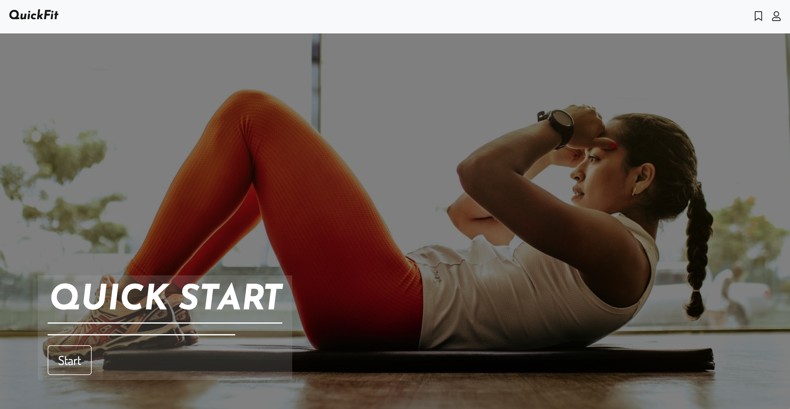
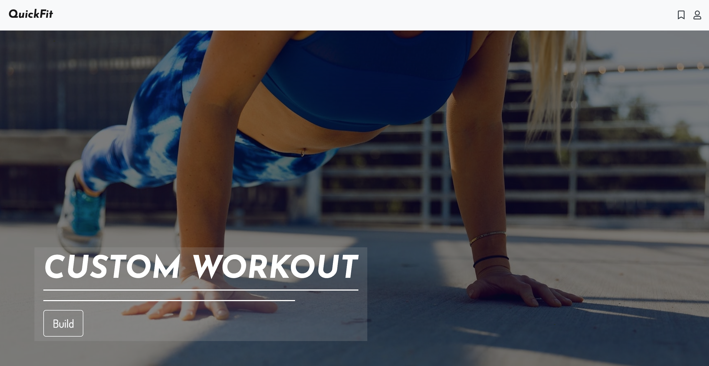
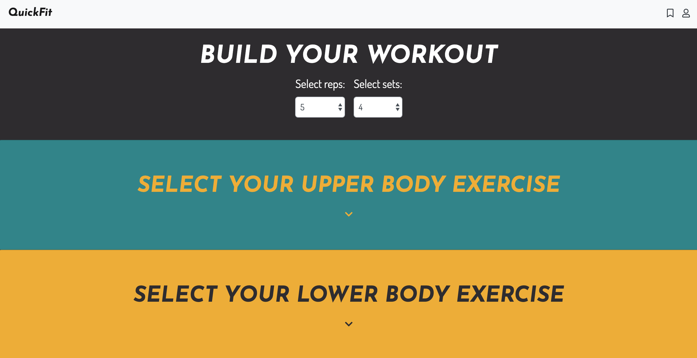
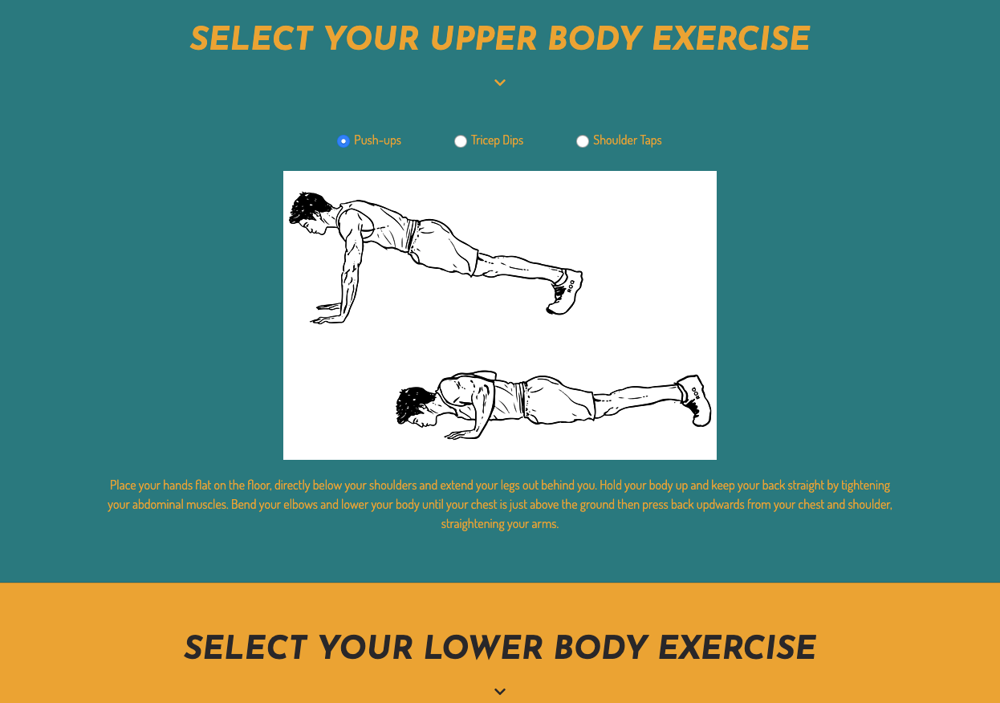
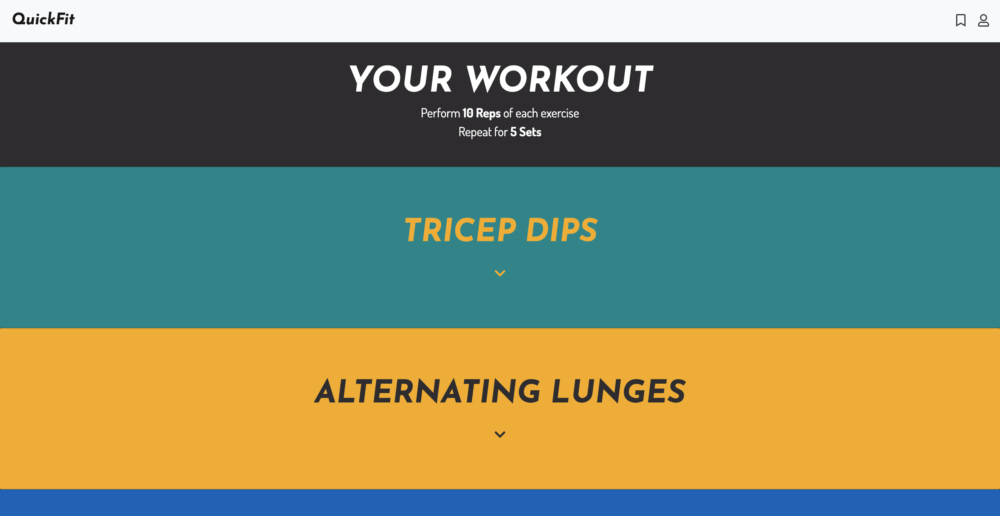
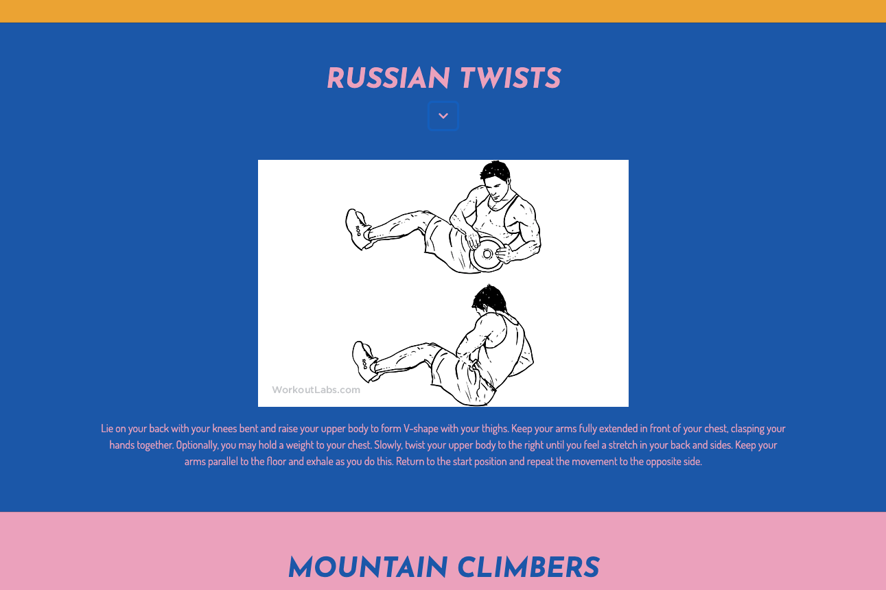
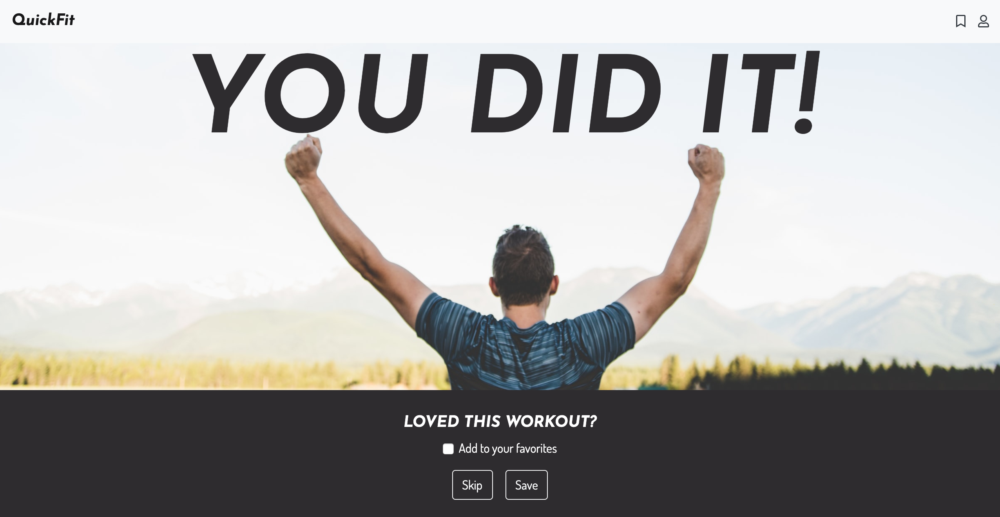
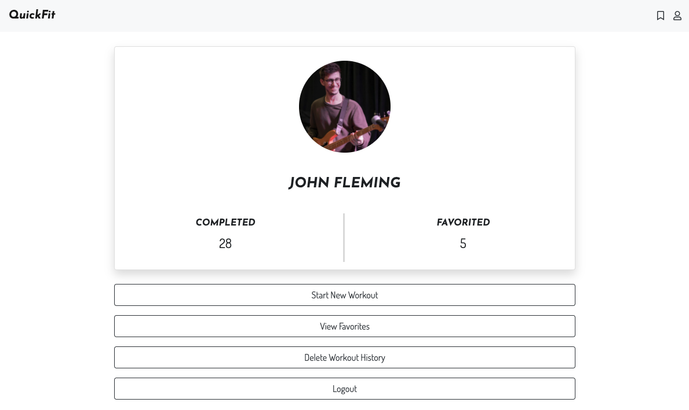
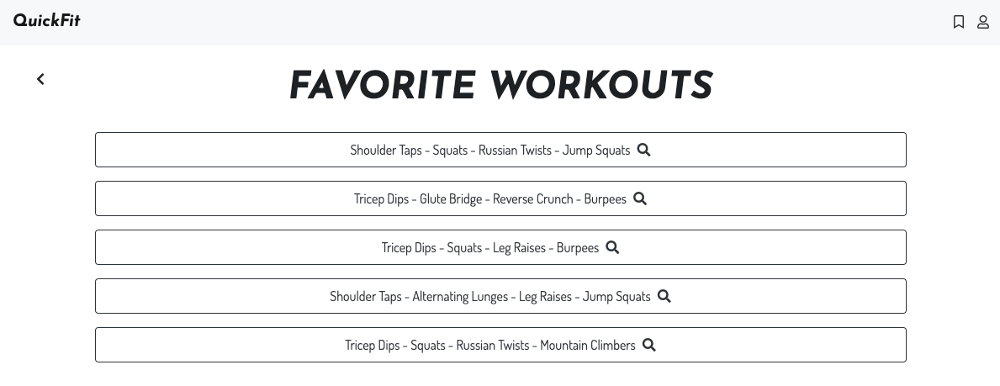
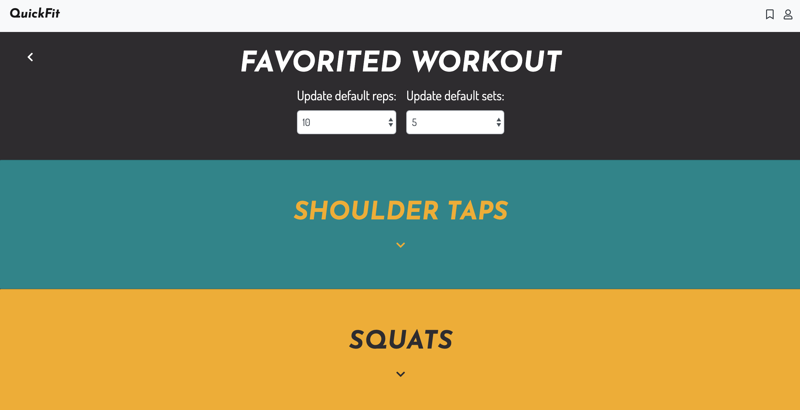

# QuickFit - NSS Front End Capstone

## Description
I built this React app as my final project for the front end portion of my curriculum at Nashville Software School. It showcases the tech, tools, and processes I have learned to date and was inspired by the Covid-19 Quarantine in 2020. 

The main purpose and functionality of the app are simple: to provide users a way to quickly plan and complete a bodyweight workout in as few as one click. Due to the quarantine, many people including myself found themselves unable to go to a gym and had to resort to at home workouts to stay in shape. Since I am not a fitness expert and did not have the time to regularly plan exercises, I built this app to take the difficulty out of the process.

The app features two main workout modes: Quick Start and Custom. After authenticating through their Google account, users can instantly start a workout with one click in the Quick Start mode. Behind the scenes, a randomized selection of exercises are chosen for the user, one each from four main muscle group or exercise type categories, and presented to the user to complete on the following screen. Alternatively, the Custom mode allows users to hand-select which exercise from each category they would like to perform before being navigated to complete the workout.

After completion of a workout, the user's completed workout log is updated and the user also has the option to add the workout to a collection of favorited workouts. From the user's profile page, they can see updated counts of total completed workouts and total favorited workouts. When a user selects the option to view their favorited workouts, they can update the default reps and sets to complete for a favorited workout and choose to complete that workout again. 

Primary technologies used for the app include: Javascript, React, Bootstrap, Sass, Axios, and Firebase.

## Screenshots
### Login Page
Users are required to authenticate through their Google account to access the app

### Home Page
On the home page, the users will be presented with two full screen hero images, one with options to start a randomized workout in Quick Start mode and the other to custom build a workout in Custom mode. 

Quick Start Mode

Custom Mode

### Custom Mode Workout Builder Tool
When a user selects the Custom mode, they are routed to the below page where they can specify the number of reps and sets they would like to complete and choose four exercises. Each exercise category is presented in a separate color block that expands on click to display the exercise options and details about each exercise. 

Workout Builder Tool

Expanded Exercise Category

### Live Workout Page

After selecting the Quick Start mode or building a Custom workout, the user is navigated to the below screen with instructions for the workout and each exercise to complete listed. On click, the exercise row expands to display a diagram and description of the exercise as a prompt.

Expanded exercise with description

### Post Workout Page

After completing a workout, the user is navigated to the below page where they can choose to favorite the workout for later use.

### Profile Page

The user profile displays details about the user's workout history and gives them options to start a new workout, view their favorite workouts, delete all workout history, and logout.

### Favorites Page

Either from the navbar or through the profile page, users can view a collection of past workouts they have completed and saved to their favorite workouts collection. This page simply displays the exercise names for the completed workout, and clicking on an individual workout routes the user to a new page to view more details for that workout. 

### Individual Favorite Workout Page

Here a user can view the details of a specific favorited workout they've completed. The functionality works similarly to the live workout page, as the user can expand the exercise rows to view details about the exercise. They can also update the default number of reps and sets to complete, unfavorite the workout, or launch the workout to complete it again. 

## How to run
1. Clone this repo
1. Run `npm install` in your command line
1. `npm start` runs the app in development mode
1. Open [http://localhost:3000](http://localhost:3000) to view it in the browser.

View live app here: https://front-end-capstone-b93f7.web.app/
