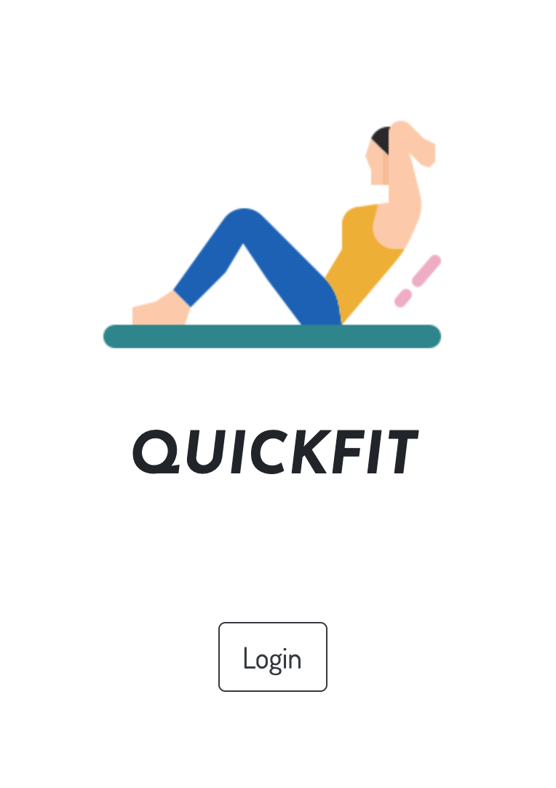

# QuickFit - NSS Front End Capstone

## Description
I built this React app as my final project for the front end portion of my curriculum at Nashville Software School. It showcases the tech, tools, and processes I have learned to date and was inspired by the Covid-19 Quarantine in 2020. 

The main purpose and functionality of the app are simple: to provide users a way to quickly plan and complete a bodyweight workout in as few as one click. Due to the quarantine, many people including myself found themselves unable to go to a gym and had to resort to at home workouts to stay in shape. Since I am not a fitness expert and did not have the time to regularly plan exercises, I built this app to take the difficulty out of the process.

The app features two main workout modes: Quick Start and Custom. After authenticating through their Google account, users can instantly start a workout with one click in the Quick Start mode. Behind the scenes, a randomized selection of exercises are chosen for the user, one each from four main muscle group or exercise type categories, and presented to the user to complete on the following screen. Alternatively, the Custom mode allows users to hand-select which exercise from each category they would like to perform before being navigated to complete the workout.

After completion of a workout, the user's completed workout log is updated and the user also has the option to add the workout to a collection of favorited workouts. From the user's profile page, they can see updated counts of total completed workouts and total favorited workouts. When a user selects the option to view their favorited workouts, they can update the default reps and sets to complete for a favorited workout and choose to complete that workout again. 

Primary technologies used for the app include: Javascript, React, Bootstrap, Sass, Axios, and Firebase.

## Screenshots

## How to run
1. Clone this repo
1. Run `npm install` in your command line
1. `npm start` runs the app in development mode
1. Open [http://localhost:3000](http://localhost:3000) to view it in the browser.

View live app here: https://front-end-capstone-b93f7.web.app/
